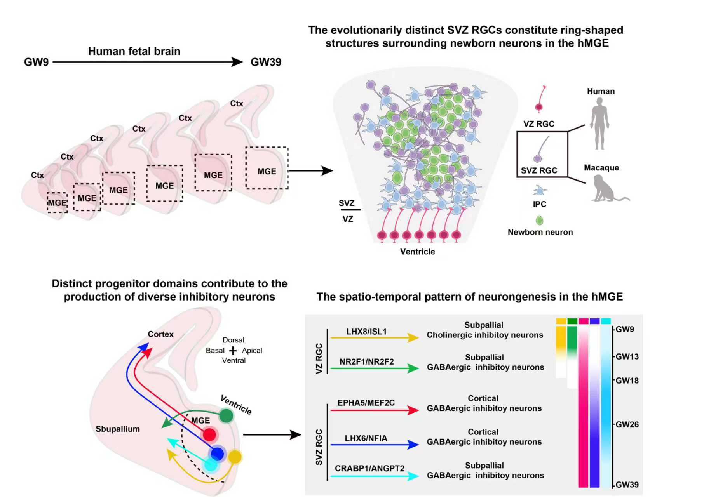

# Bioinformatic Method
## Non-epithelial radial glial cells sustain GABAergic neurogenesis and gliogenesis in the developing human brain
The human cerebral cortex has an extensive and diverse complement of inhibitory neurons (INs), which contributes to the heightened cognitive capability of our species. However, the mechanisms underlying the generation of the vast repertoire of human INs remain elusive. We performed spatial and single-cell transcriptomics of human medial ganglionic eminence (hMGE), a pivotal source of INs destined for the cerebral cortex and subpallium, to build the developmental trajectories of MGE-derived cells throughout pregnancy. We identified spatiotemporally and molecularly segregated progenitor cell populations fated to produce distinct types of INs. Notably, we found a novel progenitor cell type in the hMGE subventricular zone (SVZ RGC) with unique molecular and cellular features. We demonstrated that SVZ RGCs maintained the production of INs and glial cells throughout human brain development. Our findings reveal evolutionarily distinct features of IN generation and shed light on the unique mechanisms underlying human brain development.

### Keywords
Human brain development; brain evolution; medial ganglionic eminence; cortical inhibitory neurons; progenitor cell diversity; neuronal diversification; spatial transcriptomics; single-cell RNA sequencing


<!-- PROJECT SHIELDS -->

<!--
[![Contributors][contributors-shield]][contributors-url]
[![Forks][forks-shield]][forks-url]
[![Stargazers][stars-shield]][stars-url]
[![Issues][issues-shield]][issues-url]
[![MIT License][license-shield]][license-url]
[![LinkedIn][linkedin-shield]][linkedin-url]
-->

<!-- PROJECT LOGO -->
<br />

<p align="center">
  <a href="https://github.com/MiLabTsinghua/hMGE_evodevo/">
    
  </a>

  <h3 align="center">Non-epithelial radial glial cells sustain GABAergic neurogenesis and gliogenesis in the developing human brain</h3>
  <p align="center">
    Bioinformatic Method
    <br />
    <a href="https://github.com/MiLabTsinghua/hMGE_evodevo"><strong>探索本项目的文档 »</strong></a>
    <br />
  <!--   
    <br />
    <a href="https://github.com/MiLabTsinghua/hMGE_evodevo">查看Demo</a>
    ·
    <a href="https://github.com/MiLabTsinghua/hMGE_evodevo/issues">报告Bug</a>
    ·
    <a href="https://github.com/MiLabTsinghua/hMGE_evodevo/issues">提出新特性</a>
   -->
  </p>

</p>

## Data Resource

### Raw Data
The raw sequence data reported in this paper have been deposited in the GenomeSequence Archive in National Genomics Data Center ([HRA009228](https://ngdc.cncb.ac.cn/gsa-human/HRA009228), [HRA009966](https://ngdc.cncb.ac.cn/gsa-human/HRA009966), [HRA012942](https://ngdc.cncb.ac.cn/gsa-human/HRA012942)) that are publicly accessible at https://ngdc.cncb.ac.cn/gsa-human

### Processed Data
The processed data in this paper have been deposited in the Open Archive for Miscellaneous Data in National Genomics Data Center ([OMIX012484](https://ngdc.cncb.ac.cn/omix/OMIX012484), [OMIX](https://ngdc.cncb.ac.cn/omix/OMIX)) that are publicly accessible at https://ngdc.cncb.ac.cn/omix/

### Paper Link

[Non-epithelial radial glial cells sustain GABAergic neurogenesis and gliogenesis in the developing human brain](https://www.nature.com/articles/)

#### INTRODUCTION
The human cerebral cortex expanded dramatically during evolution, with a notable increase in the ratio of inhibitory to excitatory neurons. This shift supports complex circuitry and higher-order cognition. However, how the human brain generates its diverse inhibitory neurons remains unclear.

#### RATIONALE
Cortical outer radial glia (oRG, also known as bRG), a primate-enriched progenitor population in the cortical subventricular zone (SVZ), has been identified as a key driver of the expanded production of excitatory neurons through prolonged neurogenesis. In comparison, the vast majority of cortical GABAergic inhibitory neurons originate from the subpallium, specifically the medial ganglionic eminence (MGE), an important progenitor domain in the developing brain. Notably, the MGE in primates, particularly in human species, shows increased complexity through the evolutionarily expanded SVZ and the emergence of distinct cellular organization. This raises a pivotal question: do novel subpallial progenitor populations, akin to oRG cells, amplify inhibitory neuron production?

#### RESULTS
We mapped the spatiotemporal landscape of neurogenesis and gliogenesis in the human MGE, revealing a markedly expanded SVZ that sustains prolonged inhibitory-neuron production. Within this niche we identified a novel primate-enriched radial glial population—SVZ RGCs—absent in mice but present in macaques. These SVZ RGCs continuously generate GABAergic interneurons and glia throughout development, providing a new cellular substrate for the evolutionary expansion of human inhibitory circuitry.

#### CONCLUSION
Our study revealed evolutionarily distinct features of human inhibitory neuron generation and shed light on the unique mechanisms underlying human brain development. Notably, the hMGE SVZ RGC is a new addition to the pantheon of neural progenitor cell types, marking an important new cytogenic source in the human brain.

#### FIGURE LEGEND
hMGE SVZ RGCs maintain the production of GABAergic inhibitory neurons in the developing human brain. we depict a comprehensive cellular and molecular landscape of hMGE (box) development from gestational week (GW) 9 to 39 and uncovered an evolutionarily distinct RGC type within the hMGE SVZ (SVZ RGC) with unique molecular and cellular features. We identified spatiotemporally and molecularly segregated progenitor cell populations (Pie charts in different colors) fated to produce distinct types of INs (Arrows in different colors). We demonstrated that SVZ RGCs maintained the production of INs throughout human brain development.


<!-- 
 本篇README.md面向开发者
 
## 目录

- [上手指南](#上手指南)
  - [开发前的配置要求](#开发前的配置要求)
  - [安装步骤](#安装步骤)
- [文件目录说明](#文件目录说明)
- [开发的架构](#开发的架构)
- [部署](#部署)
- [使用到的框架](#使用到的框架)
- [贡献者](#贡献者)
  - [如何参与开源项目](#如何参与开源项目)
- [版本控制](#版本控制)
- [作者](#作者)
- [鸣谢](#鸣谢)

### 上手指南

请将所有链接中的“shaojintian/Best_README_template”改为“your_github_name/your_repository”


###### 开发前的配置要求

1. xxxxx x.x.x
2. xxxxx x.x.x

###### **安装步骤**

1. Get a free API Key at [https://example.com](https://example.com)
2. Clone the repo

```sh
git clone https://github.com/shaojintian/Best_README_template.git
```

### 文件目录说明
eg:

```
filetree 
├── ARCHITECTURE.md
├── LICENSE.txt
├── README.md
├── /account/
├── /bbs/
├── /docs/
│  ├── /rules/
│  │  ├── backend.txt
│  │  └── frontend.txt
├── manage.py
├── /oa/
├── /static/
├── /templates/
├── useless.md
└── /util/

```


### 开发的架构 

请阅读[ARCHITECTURE.md](https://github.com/shaojintian/Best_README_template/blob/master/ARCHITECTURE.md) 查阅为该项目的架构。

### 部署

暂无

### 使用到的框架

- [xxxxxxx](https://getbootstrap.com)
- [xxxxxxx](https://jquery.com)
- [xxxxxxx](https://laravel.com)

### 贡献者

请阅读**CONTRIBUTING.md** 查阅为该项目做出贡献的开发者。

#### 如何参与开源项目

贡献使开源社区成为一个学习、激励和创造的绝佳场所。你所作的任何贡献都是**非常感谢**的。


1. Fork the Project
2. Create your Feature Branch (`git checkout -b feature/AmazingFeature`)
3. Commit your Changes (`git commit -m 'Add some AmazingFeature'`)
4. Push to the Branch (`git push origin feature/AmazingFeature`)
5. Open a Pull Request


### 版本控制

该项目使用Git进行版本管理。您可以在repository参看当前可用版本。

### 作者

xxx@xxxx

知乎:xxxx  &ensp; qq:xxxxxx    

 *您也可以在贡献者名单中参看所有参与该项目的开发者。*

### 版权说明

该项目签署了MIT 授权许可，详情请参阅 [LICENSE.txt](https://github.com/shaojintian/Best_README_template/blob/master/LICENSE.txt)

### 鸣谢


- [GitHub Emoji Cheat Sheet](https://www.webpagefx.com/tools/emoji-cheat-sheet)
- [Img Shields](https://shields.io)
- [Choose an Open Source License](https://choosealicense.com)
- [GitHub Pages](https://pages.github.com)
- [Animate.css](https://daneden.github.io/animate.css)
- [xxxxxxxxxxxxxx](https://connoratherton.com/loaders)

-->

<!-- links -->

<!-- 
[your-project-path]:shaojintian/Best_README_template
[contributors-shield]: https://img.shields.io/github/contributors/shaojintian/Best_README_template.svg?style=flat-square
[contributors-url]: https://github.com/shaojintian/Best_README_template/graphs/contributors
[forks-shield]: https://img.shields.io/github/forks/shaojintian/Best_README_template.svg?style=flat-square
[forks-url]: https://github.com/shaojintian/Best_README_template/network/members
[stars-shield]: https://img.shields.io/github/stars/shaojintian/Best_README_template.svg?style=flat-square
[stars-url]: https://github.com/shaojintian/Best_README_template/stargazers
[issues-shield]: https://img.shields.io/github/issues/shaojintian/Best_README_template.svg?style=flat-square
[issues-url]: https://img.shields.io/github/issues/shaojintian/Best_README_template.svg
[license-shield]: https://img.shields.io/github/license/shaojintian/Best_README_template.svg?style=flat-square
[license-url]: https://github.com/shaojintian/Best_README_template/blob/master/LICENSE.txt
[linkedin-shield]: https://img.shields.io/badge/-LinkedIn-black.svg?style=flat-square&logo=linkedin&colorB=555
[linkedin-url]: https://linkedin.com/in/shaojintian
 -->


